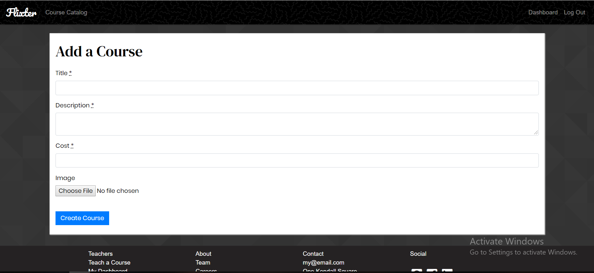

Flixter
=======

Flixter is a two-sided, video-streaming marketplace platform similar to Udemy that allows students to sign up for courses created by instructors.

Technologies Used:
------------------

..* Ruby, v. 2.5.3 (primary programming language)
..* Javascript/JQuery/AJAX (event listening)
..* Rails (framework)
..* Bootstrap (design elements)
..* Stripe API (user payments)
..* Devise (user authentication)
..* Carrierwave (image and video uploading)
..* AWS (image and video storage)
..* Ranked-model (drag-and-drop interface --instructors)

Interface
---------

After signing up as a registered user of the platform, users may become instructors by deciding to "Create a Course" with a title, description, and cover image.

