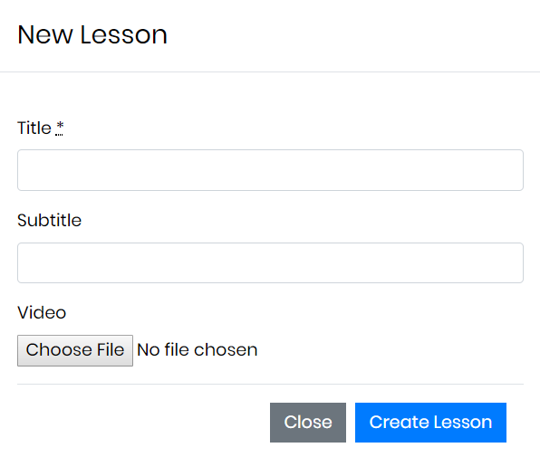
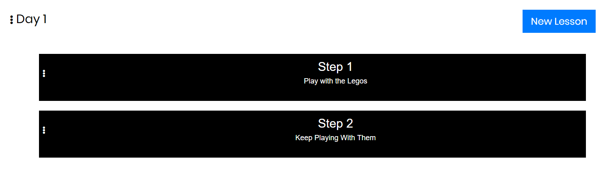
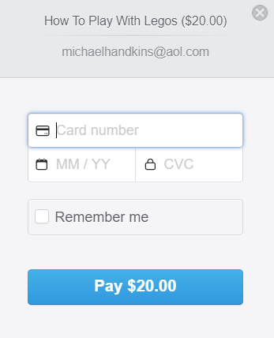

Flixter
=======

Flixter is a two-sided, video-streaming marketplace platform similar to Udemy that allows students to sign up for courses created by instructors.

Technologies Used:
------------------

  * Ruby, v. 2.5.3 (primary programming language)
  * Javascript/JQuery/AJAX (event listening)
  * Rails (framework)
  * Bootstrap (design elements)
  * Stripe API (user payments)
  * Devise (user authentication)
  * Carrierwave (image and video uploading)
  * AWS (image and video storage)
  * Ranked-model (drag-and-drop interface --instructors)

Interface
---------

After signing up as a registered user of the platform, users may become instructors by deciding to "Teach a Course" with a title, description, and cover image.

From the view of their newly created course page, instructors will see the option to "Administer Course."

From there, they will have the ability to add new sections and lessons to their course... 

...as well as rearrange sections and lessons in whatever order they choose via the drag and drop interface.

Students (any registered user of Flixter) will then have the freedom of signing up for any available course. An instructor may choose to make their course available for free, but otherwise students will pay for each course using Stripe's integrated API.

This project is deployed at https://flixter-handkins.herokuapp.com/

